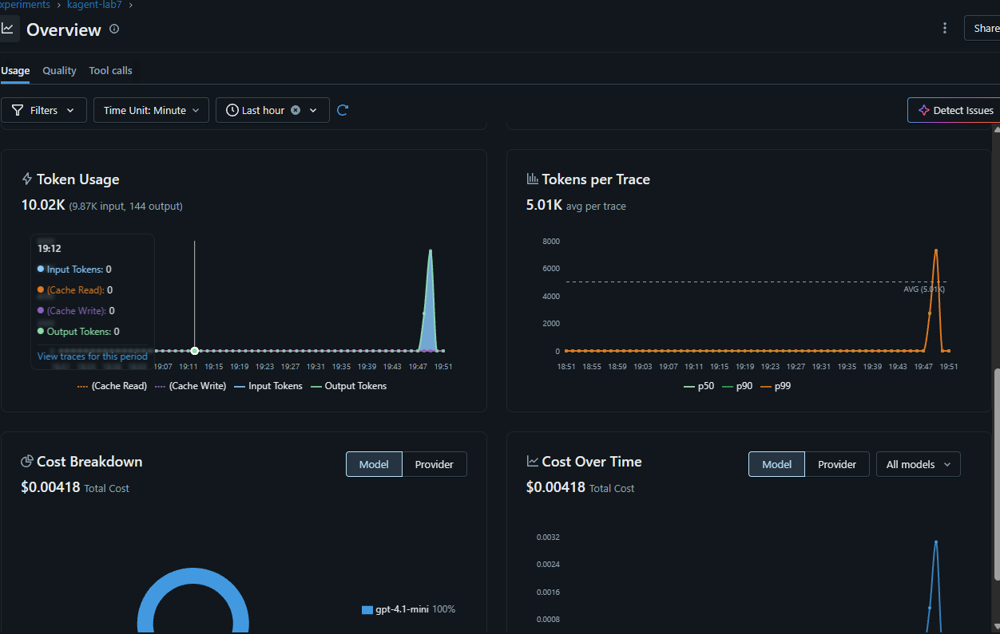
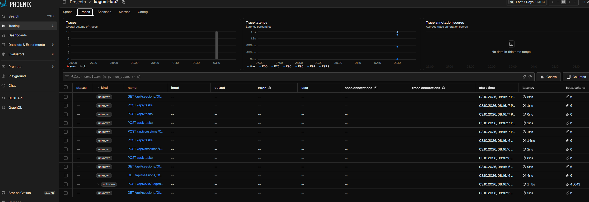

# ADR-007: Compare OpenTelemetry, MLflow, and Phoenix for GenAI Observability

- Status: Accepted
- Date: 2026-10-03
- Owners: Abox laboratory team

## Context

Laboratory 7 requires reviewing the OpenTelemetry, MLflow, and Phoenix
interfaces; collecting traces from an agent; and comparing the three solutions
from a GenAI observability perspective.

The selected workload is the kagent `k8s-agent`. Its OpenTelemetry tracing was
enabled and configured to export OTLP/gRPC traces through the OpenTelemetry Demo
Collector. The downstream MLflow Collector routes traces from the `kagent`
namespace to MLflow experiment `kagent-lab7` and Phoenix project
`kagent-lab7`.

The detailed experiment record and screenshots are maintained in the
[Laboratory 7 report](../reports/lab7-genai-observability.md).

## Current evidence

MLflow successfully received agent traces and presented GenAI-specific
analytics. The captured interface includes trace status and duration, token
usage, latency, error rate, model attribution, and estimated cost.

Phoenix initially rejected the OTLP/HTTP requests with `401 Unauthorized`.
Authentication was added to the Collector with a Phoenix System API key stored
in the `mlflow/phoenix-otel-credentials` Secret and passed as a Bearer token.
After a new agent request, Phoenix created project `kagent-lab7` automatically
and displayed its traces. No project ID or manual project creation was needed.

## Decision

Keep OpenTelemetry as the common instrumentation and transport layer and retain
both specialized backends for the laboratory comparison. Prefer MLflow as the
primary interface for day-to-day inspection of this kagent workload.

This preference is based on operator usability rather than a claim that MLflow
has a universally larger feature set. For this experiment, MLflow made the most
important GenAI information immediately visible in one experiment view:
request traces, token usage, model attribution, latency, errors, and estimated
cost. Its experiment-oriented navigation and overview charts required less
interpretation.

Phoenix successfully stored the same workload and provided trace volume and
latency charts, plus broader facilities for datasets, evaluators, annotations,
prompts, and a playground. However, many imported kagent spans were displayed
with kind `unknown`, empty input/output columns, and zero tokens, while only the
agent-level span exposed the token count. This made the tested trace list less
immediately readable than MLflow for this particular instrumentation schema.

## Consequences

- Both MLflow and Phoenix are validated as working destinations for the
  selected agent.
- MLflow is the preferred UI for this laboratory because it presents the
  available GenAI usage and cost data more clearly for the current spans.
- Phoenix remains valuable when the workflow needs datasets, evaluations,
  annotations, prompt management, or playground-based analysis.
- OpenTelemetry remains necessary independently of the eventual UI choice,
  because it decouples agent instrumentation from the analysis backend.
- Phoenix authentication is an operational dependency: its API key must remain
  in a Kubernetes Secret and must not be committed to Git.

## Limitations and follow-up questions

1. Which additional OpenInference attributes would allow Phoenix to classify
   the imported spans instead of showing kind `unknown`?
2. Can prompts, responses, and tool calls be normalized so that Phoenix fills
   its input/output columns consistently?
3. Are token and cost calculations consistent between MLflow and Phoenix after
   both receive fully normalized OpenInference spans?
