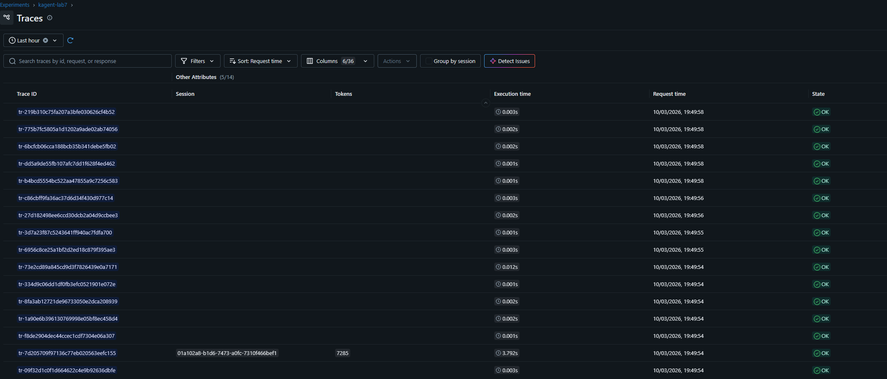
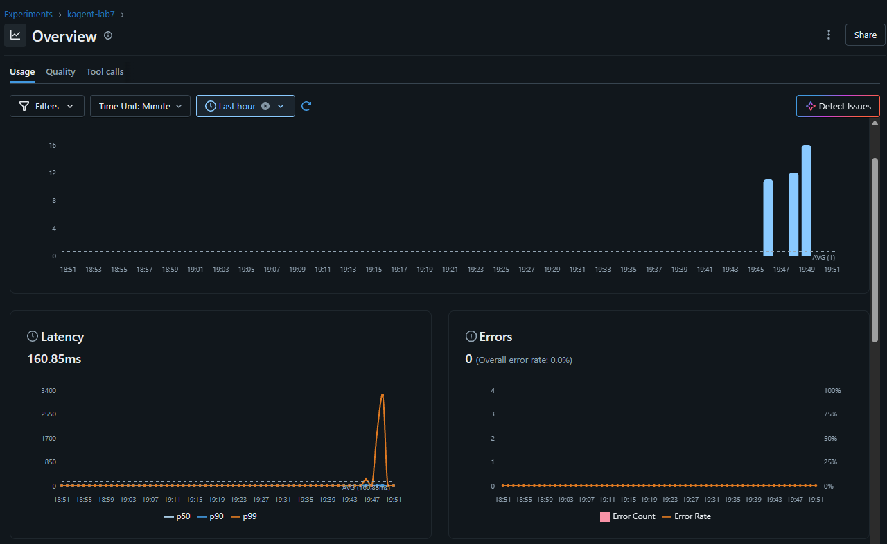

# Laboratory 7: GenAI Observability Comparison

- Date: 2026-10-03
- Status: Complete
- Agent under test: kagent `k8s-agent`
- MLflow experiment: `kagent-lab7` (experiment ID `2`)
- Phoenix project: `kagent-lab7`

## Objective

Compare standard OpenTelemetry, MLflow, and Phoenix as observability solutions
for a GenAI agent. The experiment uses the same OpenTelemetry traces emitted by
`k8s-agent` and attempts to deliver them to both MLflow and Phoenix.

## Telemetry path

The agent exports OTLP/gRPC traces to the OpenTelemetry Demo Collector. The
Collector forwards them to the MLflow Collector, which routes traces from the
`kagent` namespace to two backends:

1. MLflow experiment `kagent-lab7`;
2. Phoenix project `kagent-lab7`, selected with the
   `openinference.project.name` resource attribute.

The active `k8s-agent` deployment reported `OTEL_TRACING_ENABLED=true` and used
`http://otel-collector.otel-demo.svc.cluster.local:4317` as its OTLP trace
endpoint.

## Current results

### MLflow

MLflow received and displayed the agent traces successfully. The trace list
contained successful spans and a complete agent interaction with a duration of
approximately 3.792 seconds and 7,285 tokens.

The experiment overview showed incoming trace activity, an aggregate latency of
160.85 ms for the selected period, and no reported errors.

The GenAI-specific view calculated 10.02K tokens in total (9.87K input and 144
output), an average of 5.01K tokens per trace, and an estimated total cost of
$0.00418. The recorded model was `gpt-4.1-mini`.

These results demonstrate that MLflow understands enough of the exported span
semantics to derive GenAI-oriented usage and cost metrics, rather than merely
storing generic OpenTelemetry spans.

### Phoenix

Phoenix initially returned HTTP `401 Unauthorized` for `POST /v1/traces`.
This proved that service discovery, endpoint selection, and OTLP/HTTP transport
were working, while authentication was missing. A Phoenix System API key was
stored in Kubernetes Secret `mlflow/phoenix-otel-credentials`, injected into
the Collector, and sent in the lowercase `authorization: Bearer ...` exporter
header. The key itself was not stored in Git.

After authentication and a new agent request, Phoenix accepted the telemetry
and automatically created project `kagent-lab7`; no project ID or prior manual
project creation was required. The UI displayed trace volume and latency and
included an agent request with approximately 1.5 seconds latency and 4,643
tokens.

The trace arrived successfully, but many child spans were classified as kind
`unknown` and did not populate the input, output, or token columns. This is a
semantic-mapping limitation of the current kagent spans, not a transport
failure.

## Comparison

| Solution | Observed result | GenAI value and usability |
|---|---|---|
| Standard OpenTelemetry | Agent spans are generated and routed through OTLP | Vendor-neutral collection and routing; raw span-level evidence |
| MLflow | Traces visible in experiment `kagent-lab7` | Clear experiment-oriented navigation; token usage, latency, errors, model attribution, and estimated cost were visible with little additional interpretation |
| Phoenix | Traces visible in project `kagent-lab7` after adding API-key authentication | Trace volume and latency plus datasets, evaluators, annotations, prompts, and playground features; current generic child spans were less immediately informative |

## Conclusion

OpenTelemetry is the foundation rather than a competing GenAI UI: it provides
portable instrumentation and lets one agent feed multiple analysis backends.
Both MLflow and Phoenix accepted the kagent traces after their destination-
specific routing and authentication requirements were configured.

For the operator performing this laboratory, MLflow looked more convenient.
Its experiment page exposed the relevant GenAI measurements together and made
token consumption, model use, cost, latency, and failures easier to understand
at a glance. Phoenix offers stronger-looking workflows around datasets,
evaluators, annotations, prompt management, and playground experiments, but
the current kagent/OpenTelemetry semantics did not populate all of its trace
columns. The preference is therefore scoped to inspecting this agent with the
telemetry currently emitted, not a general conclusion that MLflow is superior
for every GenAI observability use case.
